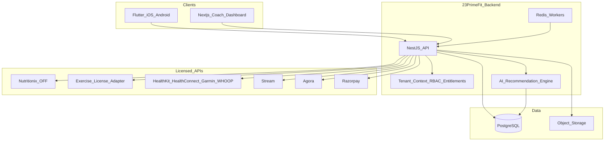
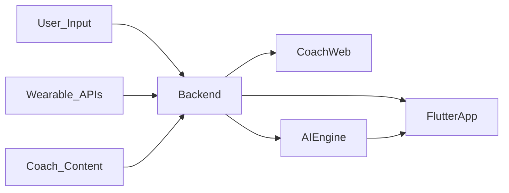

# 23PrimeFit iOS & Android App Plan

## Context
Product goal: one multi-tenant Health & Performance ecosystem (workouts, nutrition, wearables, coaching) for general fitness, weight loss, athletes, cricket, lifestyle disorders, and coaches.

Independent coaches and coaching companies register, create an isolated workspace, and purchase a 23PrimeFit service plan to manage their clients. 23PrimeFit also operates its own internal tenant for company coaches and direct clients.

**Locked decisions**
- Mobile: **Flutter** (single codebase → iOS + Android)
- Scope: **full architecture (Phases 1–6)**; first build = **Phase 1**
- Backend: **NestJS + PostgreSQL + Prisma + Redis**
- Coach dashboard: **Next.js** (web; Phase 5 UI, scaffolded early)
- Auth: **Firebase Auth** (email/OTP + social); API verifies Firebase JWT
- Media: **Cloudflare R2 / S3** (progress photos, blood reports, exercise assets)
- Chat / video / payments (Phase 5+): **Stream**, **Agora**, **Razorpay** (+ Stripe later)
- Tenancy: each coaching business is an isolated `Tenant`; tenant memberships determine roles and all operational data is tenant-scoped
- First-party operation: 23PrimeFit coaches and clients use a dedicated `PRIMEFIT_INTERNAL` tenant

## Target architecture



**Design principle (from PDF):** buy licensed data/APIs; build unique value (coaching programs, metabolic health, Female Health, Healthspan, cricket later, AI guidance, unified UX). WHOOP, Garmin Connect, Health Connect, MyFitnessPal, Workout for Women, and Cal AI are competitive benchmarks — not required one-to-one integrations.

## Monorepo layout (to create)

```
23PrimeFit/
  apps/
    mobile/          # Flutter client
    coach-web/       # Next.js coach dashboard
    api/             # NestJS backend
  packages/
    shared-types/    # OpenAPI-generated or shared DTOs
  docs/
    architecture.md
    data-sources.md
```

## Domain model (core entities)

- **User / Profile** — global identity and personal profile
- **Tenant** — isolated workspace (`EXTERNAL_COACH_BUSINESS` or `PRIMEFIT_INTERNAL`)
- **TenantMembership** — owner/admin/coach/nutritionist/staff/analyst authorization inside a tenant
- **ClientMembership / Coach–Client** — client enrollment and coach assignment inside one tenant
- **Plan / Subscription / Entitlement / UsageMeter** — tenant purchase, limits, feature access, trial/grace/read-only states
- **Invoice / PaymentAttempt / SubscriptionEvent** — coach-business billing by 23PrimeFit, separate from client payments collected by coaches
- **WorkoutProgram / WorkoutSession / Exercise** — library + assigned plans
- **NutritionLog / FoodItem / Recipe / MealPlan**
- **WearableSnapshot** — sleep, stress, steps, HR, HRV, VO₂, SpO₂, calories, training load
- **ProgressPhoto / HealthReport** — uploads + metadata
- **MessageThread / Consultation / Notification / Payment**
- **FemaleHealthProfile / CycleLog / SymptomCheckIn** — opt-in menstrual/female-health tracking; phase estimates; coach share only with granular consent
- **HealthspanSnapshot** — versioned Healthspan score, Biological Age, pace/trend, pillar `explainJson`, coverage confidence, `modelVersion`

Every tenant-owned model carries `tenantId`. Authorization requires tenant membership plus role permission. Unique constraints, object-storage paths, queues, caches, search, analytics, AI knowledge, exports, and audit logs are tenant-scoped. Platform-admin support access is explicit and audited. Cycle and Healthspan data are private by default and require purpose-scoped `ConsentRecord` entries (`female_health_tracking`, `female_health_coach_share`, `healthspan_insights`).

All commercial providers behind **adapters** so Nutritionix ↔ FatSecret or Gym Visual ↔ MoveKit can swap without rewriting app screens.

## Coach SaaS onboarding

1. Coach registers and verifies identity.
2. Coach creates a workspace with business profile, branding, timezone, and currency.
3. Coach selects a trial or paid 23PrimeFit plan.
4. Subscription activation grants server-enforced client, seat, storage, AI, integration, and reporting entitlements.
5. Tenant owner invites staff and clients.
6. Users with multiple memberships select an active workspace for every request.

Platform admins separately manage tenants, subscriptions, plans, usage, audited support access, and the 23PrimeFit internal workspace.

## Provider choices (MVP defaults)

| Feature | Provider (MVP) | Phase |
|---------|----------------|-------|
| Exercise media | Licensed DB adapter (schema first; Gym Visual/MoveKit when licensed) | 2 |
| Food DB | Nutritionix | 3 |
| Barcode | Open Food Facts (+ Nutritionix fallback) | 3 |
| Recipes | Spoonacular | 3 |
| Wearables | HealthKit + Health Connect first; Garmin/WHOOP OAuth next | 4 |
| Chat | Stream | 5 |
| Video consult | Agora | 5 |
| Payments | Razorpay | 5 |
| AI coach | OpenAI + private knowledge base | 6 |

## Flutter app structure

`apps/mobile` — feature-first + clean architecture:

- `lib/core` — theme, routing (go_router), DI, networking (Dio), secure storage
- `lib/features/auth|profile|dashboard|workouts|nutrition|wearables|coach|progress|ai`
- State: **Riverpod**
- Local cache: **Drift/SQLite** for offline workout/nutrition day logs
- Push: **Firebase Cloud Messaging**

**Client app IA (bottom nav after login)**
1. Home (dashboard)
2. Train (workouts)
3. Fuel (nutrition)
4. Recover (wearables/sleep/stress)
5. Coach (messages / booking / content)

## Phase roadmap

### Phase 1 — Login, Client Profile, Dashboard *(first implementation)*
- Firebase Auth (email + Google; phone OTP optional)
- Coach registration, tenant creation, demo-trial activation, invitations, active-workspace selection, and membership RBAC
- Seed the 23PrimeFit internal tenant and migrate existing company coaches/clients into it
- Onboarding: age, sex, height, weight, goals, lifestyle-disorder tags, activity level
- Profile CRUD via NestJS
- Home dashboard shells: today’s summary placeholders (workout, nutrition, recovery cards)
- Coach-web scaffold: login + empty clients list
- CI stubs, env templates, OpenAPI contract for `/auth`, `/users/me`, `/dashboard`

### Phase 2 — Workout Builder + Exercise Library
- Exercise catalog API + media CDN URLs
- Coach assigns programs; client completes sessions (sets/reps/RPE)
- Flutter workout player (video + cues)
- Progress photos upload

### Phase 3 — Nutrition & Recipes
- Food search, barcode scan, meal logging, macros/calories
- Coach nutrition plans; recipe browse
- Daily nutrition card on dashboard

### Phase 4 — Wearables
- iOS HealthKit + Android Health Connect sync (steps, HR, sleep, active energy, VO₂ where available)
- Backend normalize → `WearableSnapshot`
- Recover tab charts; later Garmin/WHOOP connectors

### Phase 5 — Coach Dashboard, Chat, Consultation
- Tenant-aware coach web: workspace/team settings, clients, assign workouts/nutrition, notes
- Tenant-owner service plan, subscription, invoice, usage, and upgrade screens
- Platform-admin tenant and subscription operations
- Stream chat in Flutter + web
- Agora video booking + Razorpay for paid consults
- Notifications (FCM)

### Phase 6 — AI + Health intelligence
- Ingest workouts + nutrition + wearables + uploaded blood reports
- Recommendations, progress reports; cricket analytics as follow-ons
- Human-in-the-loop coach approval before client-facing AI insights

### Phase 6.5 — Female Health (opt-in wellness)
- Opt-in cycle tracking, check-ins, phase estimates, irregular-cycle support
- Cycle-aware workout/nutrition/recovery suggestions (wellness only)
- Coach visibility only with explicit share consent; tenant-scoped audit/export/delete

### Phase 6.6 — Healthspan / Biological Age
- Versioned Healthspan score, Biological Age, pace/trend, pillar explainability, coverage confidence
- Baseline data gate before first estimate; wellness copy only; coach HITL for surfaced insights
- Consent `healthspan_insights` and tenant isolation on every score run

## Data flows (from PDF)



- **Nutrition:** Nutritionix/OFF → search/scan/recipes → Nutrition Tracker  
- **Exercise:** Licensed DB → videos/images/muscles/equipment → Workout Builder → Client Workout  
- **AI:** wearables + history + nutrition + reports + coach content → recommendations  

## Phase 1 build slice (concrete deliverables)

1. Initialize monorepo: Flutter app, NestJS API, Next.js coach-web stubs  
2. PostgreSQL schema: `users`, `profiles`, `tenants`, `tenant_memberships`, `client_memberships`, `coach_clients`, `plans`, `subscriptions`, `entitlements`, `usage_meters`  
3. Auth bridge: Firebase token → user upsert → active tenant context → role and entitlement guards  
4. Coach onboarding: workspace creation, trial activation, staff/client invitations  
5. Flutter screens: splash, login, invitation acceptance, onboarding, profile edit, home dashboard  
6. Coach web: workspace selection, subscription state, client list, invite-client path
7. Design system: shared brand tokens and responsive typography
8. Docs: data sources, tenant boundaries, billing lifecycle, API contracts, and environment templates

## Out of scope for first code pass
Phases 2–6 implementation (planned only). No real Nutritionix/Stream keys until those phases. No AI until Phase 6.

## Success criteria (Phase 1)
- Install Flutter app on iOS Simulator + Android emulator  
- Sign up / sign in, complete onboarding, edit profile, see personalized dashboard shell  
- Independent coach can register, activate a workspace trial, and invite a client
- 23PrimeFit can manage its own coaches and clients inside the internal tenant
- Coach web and API expose only active-tenant data
- Cross-tenant integration tests prove tenant A cannot access tenant B data

## Product references (benchmarks, not integrations)

WHOOP, Garmin Connect, Google Health / Health Connect, MyFitnessPal, Workout for Women (cycle-aware peers), and Cal AI are competitive UX references — not required native integrations. See [`review-till-future.md`](review-till-future.md) for the differentiation table. 23PrimeFit wins by combining tenant-aware human coaching with workouts, nutrition, recovery, Female Health, Healthspan, wearables, and coach-reviewed AI.