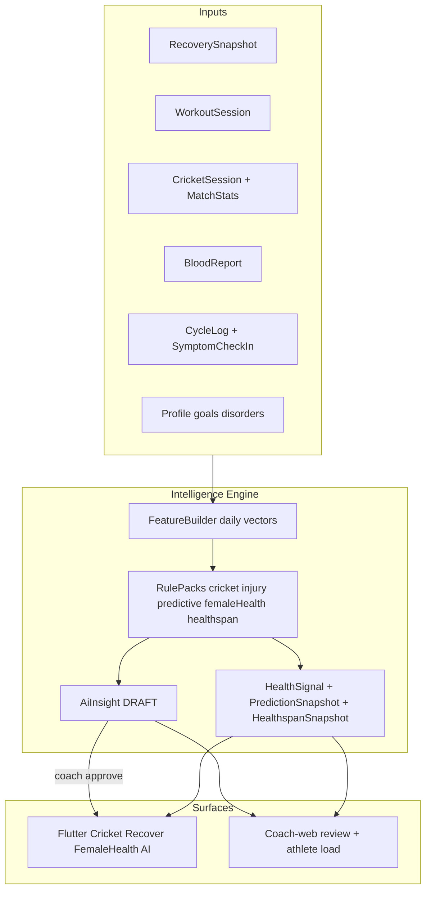
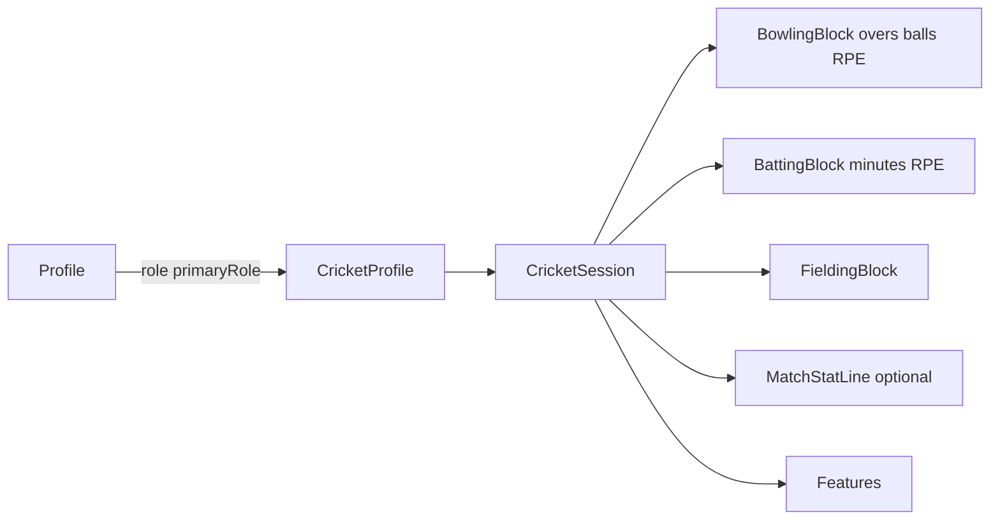

# Phase 7+ — Cricket, Injury Risk, Predictive Insights, Female Health, Healthspan

## Locked defaults (product posture)

- **Not clinical:** wellness guidance only; disclaimers everywhere; never diagnose injury, disease, fertility, or reproductive conditions.
- **Coach HITL:** all risk/prediction/Healthspan cards reuse `AiInsight` DRAFT → APPROVED (`AI_REQUIRE_COACH_APPROVAL`), same as Phase 6 ([`docs/compliance.md`](docs/compliance.md)).
- **Cricket first delivery:** player journal + load/readiness (bat/bowl/keep/all-rounder, nets/match sessions, bowling overs). Optional manual match-stat entry later. No GPS/elite video in v1.
- **Models v1:** transparent rules (ACWR acute:chronic workload, sleep debt, HRV drop, cricket bowling spikes, Healthspan pillar weights). Schema + event log designed so labeled outcomes can train ML later without rewriting Flutter screens.
- **Female Health:** opt-in only; cycle data hidden from coaches by default; share requires granular consent; no fertility prediction, contraception advice, or treatment claims.
- **Healthspan:** versioned score + Biological Age + pace/trend with coverage confidence; require baseline data before first estimate; never claim validated medical longevity science.
- **Multi-tenant isolation:** every signal, prediction, outcome, cycle log, Healthspan snapshot, job, AI draft, review, and audit event belongs to one tenant. A coach can review only clients in an active tenant membership.
- **Two operating models:** independent subscribed coach tenants and the `PRIMEFIT_INTERNAL` tenant use the same intelligence engine, with separate content, clients, models/usage accounting, and review queues.

## Why one platform, not three silos

All three PDF future items share inputs (wearables, workouts, cricket sessions, blood, goals) and outputs (scored signals → coach-reviewed insights → client UI). Build a shared **Intelligence Engine**; cricket is a domain module that feeds it.

The intelligence engine is shared infrastructure, not shared customer data. Tenant context must be present at every read, write, queue, cache, vector-search, model-usage, and analytics boundary.

## Prerequisites (before Phase 7 code)

These are already scaffolding; harden first or Phase 7 stays demo-only:

1. Real wearable history (not only `WEARABLE_DEMO`) — [`recovery.service.ts`](apps/api/src/recovery/recovery.service.ts)
2. `ai_coaching` + new consents enforced; deepen AuditLog to store **input feature hashes / key metrics** on generate ([`ai.service.ts`](apps/api/src/ai/ai.service.ts))
3. Goal-aware routing: if `CRICKET_PERFORMANCE` in `Profile.goals`, surface Cricket tab; else hide
4. Multi-tenant foundation complete: `Tenant`, `TenantMembership`, active-tenant guard, `PRIMEFIT_INTERNAL` tenant migration, subscription entitlements, and cross-tenant denial tests

---

## Workstream A — Shared intelligence foundation

### Data model (Prisma additions)

| Model | Purpose |
|-------|---------|
| `HealthSignal` | Tenant-scoped dated signal: `tenantId`, `userId`, `type` (`INJURY_RISK`, `READINESS`, `OVERREACH`, `CRICKET_BOWL_LOAD`, `PRED_SLEEP`, `CYCLE_READINESS`, `HEALTHSPAN`, …), `score` 0–100, `band` LOW/MOD/HIGH, `explainJson`, `modelVersion` |
| `PredictionSnapshot` | Tenant-scoped multi-horizon forecast: `tenantId`, `userId`, `horizonHours` (24/72/168), `metric`, `predictedValue`, `confidence`, `driversJson` |
| `HealthspanSnapshot` | Tenant-scoped Healthspan score, estimated Biological Age, pace/trend, pillar scores, coverage confidence, `modelVersion`, `asOfDate` |
| `FemaleHealthProfile` | Opt-in profile: typical cycle/period length, life stage flags, notification prefs; no clinical diagnosis fields |
| `CycleLog` / `SymptomCheckIn` | Period start/end, flow, pain, mood, energy, sleep, symptoms; daily check-ins; phase estimate metadata |
| `OutcomeLabel` | Tenant-scoped coach/athlete label (`INJURY_REPORTED`, `ILLNESS`, `MISSED_SESSION`) for future ML |
| `ConsentRecord` purposes | Add `injury_risk_insights`, `predictive_insights`, `cricket_analytics`, `female_health_tracking`, `female_health_coach_share`, `healthspan_insights` |

Extend `AiInsight.category` values: `cricket`, `injury_risk`, `predictive`, `female_health`, `healthspan` (string field already flexible) and require `tenantId` on every insight and review transition. Composite uniqueness and indexes begin with `tenantId`.

### API module

New Nest module `apps/api/src/intelligence/`:

- `FeatureBuilderService` — assembles one tenant client's last 7/28/180 days from `RecoverySnapshot`, sessions, cricket logs, cycle check-ins (if consented), and blood markers
- `RuleEngineService` — pluggable packs (`CricketRules`, `InjuryRules`, `PredictiveRules`, `FemaleHealthRules`, `HealthspanRules`)
- `POST /intelligence/run` (cron + manual) — idempotent per `tenantId+userId+dateKey`
- `GET /intelligence/today` — signals + predictions for client
- `GET /intelligence/history?from&to`
- `GET/PUT /female-health/profile`, `POST/GET /female-health/cycles`, `POST/GET /female-health/check-ins` — opt-in; coach routes require `female_health_coach_share`
- `GET /healthspan/today`, `GET /healthspan/history` — score/age/pace only after baseline + consent
- Reuse `POST /ai/insights/generate` to also emit cricket/injury/predictive/female_health/healthspan drafts from latest signals (or call intelligence from generate)

Tenant context comes from the authenticated active membership, never from a trusted client-supplied `tenantId`. Platform-admin support runs through a separate audited impersonation/support-access flow.

### Jobs

- Nightly Redis/Bull (or Nest cron) job: partition by tenant and run FeatureBuilder for active, entitled clients with consent
- On cricket session save / wearable sync: incremental recompute for that tenant/client pair
- Queue payloads, deduplication keys, rate limits, AI token meters, and dead-letter records include `tenantId`

### Flutter / coach-web

- Mobile: “Intelligence” section inside AI hub + Recover (readiness + risk band) + opt-in Female Health tab + Healthspan card
- Coach-web: extend [`apps/coach-web/src/app/ai/page.tsx`](apps/coach-web/src/app/ai/page.tsx) filters by category; show explainability chips from `explainJson`; scope review queues to the active tenant; show Female Health / Healthspan panels only when client consented to share

---

## Workstream B — Cricket Performance Analytics

### Domain

**Models**

- `CricketAthleteProfile`: `tenantId`, `userId`, `primaryRole` (BATTER/BOWLER/KEEPER/ALL_ROUNDER), `bowlingType`, `battingHand`, `teamLevel` (SCHOOL/CLUB/ACADEMY/PRO_AM)
- `CricketSession`: `tenantId`, `userId`, `dateKey`, `kind` (NETS/MATCH/GYM_CRICKET/RECOVERY), `durationMin`, `rpe`, `notes`, optional `workoutSessionId`
- `CricketBowlingLog`: overs, balls, paceTier or perceived intensity, side (L/R)
- `CricketMatchStat` (optional v1.1): runs, ballsFaced, wickets, economy — manual entry

Seed already has `cricket-athletic-prep` program — keep assigning it when goal = cricket.

### API

- `GET/PUT /cricket/profile`
- `POST/GET /cricket/sessions`
- `GET /cricket/load` — 7d/28d bowling load, ACWR, session count
- `GET /cricket/dashboard` — role-specific KPIs + latest signals

### Mobile UX

- New feature folder `apps/mobile/lib/features/cricket/`
- Entry: Home chip + Train submenu when goal includes cricket; full tab optional later
- Screens: Role setup → Log session (nets/match) → Load chart → Insights (approved only)
- Reuse mockup pastel language from existing home/schedule

### Coach-web

- Client detail: cricket load strip + pending cricket insights
- Ability to flag `OutcomeLabel` (e.g. “reported soreness”) for future ML

### Cricket rules (v1)

| Signal | Logic (transparent) |
|--------|---------------------|
| Bowl spike | 7d overs > 1.3× 28d avg → HIGH bowl load |
| Match congestion | 2+ MATCH sessions in 3 days → MOD recovery alert |
| Under-bowl taper | Match day with 7d load &lt; 50% of chronic → skill-risk note (not injury) |
| Role gap | Bowler with 0 bowling logs in 14d but gym only → programming nudge |

---

## Workstream C — Injury Risk Monitoring

### Positioning copy (ship in UI + API)

> “Training load stress indicator — not a medical injury diagnosis. Discuss with your coach.”

### Inputs

- Acute load: sum last 7d of `trainingLoad` + session RPE×duration + cricket bowling load
- Chronic load: 28d average
- **ACWR** = acute / chronic (flag &gt; 1.3 MOD, &gt; 1.5 HIGH)
- Modifiers: sleep &lt; 6h ×2 days, HRV drop &gt; 20% vs 14d baseline, stressScore high, consecutive HIGH days

### Outputs

- `HealthSignal` type `INJURY_RISK` with band + `explainJson` drivers
- `AiInsight` category `injury_risk` (coach must approve)
- Recover tab: risk gauge + “Why this score”
- Optional client self-report: pain/soreness quick log → `OutcomeLabel` (feeds later models; not required for v1 score)

### Guardrails

- Consent `injury_risk_insights` required before compute/show
- No red “you will get injured” language — use “elevated training stress”
- Coach can override band note on approve (edit body)

---

## Workstream D — Predictive Health Insights

### v1 predictions (rules / short horizon — not deep ML)

| Horizon | Metric | Method |
|---------|--------|--------|
| 24h | Readiness / recovery score | Extrapolate sleep debt + yesterday load + calendar (planned session) |
| 72h | Overreach risk | Rising ACWR trajectory + sleep trend |
| 7d | Adherence / fatigue | Missed sessions + calorie deficit streak + stress |

Store in `PredictionSnapshot`; surface as cards with confidence = rule certainty (HIGH/MED/LOW), not fake neural %).

### Later (explicitly Phase 7.5+)

- Train gradient-boosted models on `OutcomeLabel` + features when N is large enough
- Same API contract (`PredictionSnapshot.modelVersion` swaps `rules-v1` → `xgb-v2`)

### Smart meal / recovery score (PDF adjacent)

- Fold “Recovery Score” productization into intelligence `READINESS` signal (unify Recover tab heuristic)
- “Smart meal planning” stays out of this plan except: predictive insight can suggest “prioritize carbs pre-match” as text — no new meal-plan generator

---

## Workstream E — Female Health (opt-in wellness)

### Positioning copy (ship in UI + API)

> “Cycle-aware wellness guidance — not a medical diagnosis, fertility prediction, or treatment plan.”

### Scope (v1)

- Opt-in period/cycle history, flow, pain, mood, energy, sleep, symptoms, daily check-ins
- Phase estimate (menstrual / follicular / ovulatory / luteal) with irregular-cycle support
- Prioritize today’s symptoms and readiness over calendar assumptions when they conflict
- Cycle-aware workout intensity, nutrition/hydration, and recovery suggestions
- Concerning-symptom flags that recommend seeking professional care without diagnosing

### Privacy

- Consent `female_health_tracking` required to enable the module
- Consent `female_health_coach_share` required before any coach/tenant staff can view cycle data
- Private by default; export and delete paths mandatory; all access audited

### Explicitly out of v1

- Fertility prediction / ovulation prediction marketed as conception science
- Contraception advice or clinical dosing
- Pregnancy/postpartum, perimenopause, menopause — later separately reviewed scopes

---

## Workstream F — Healthspan / Biological Age

### Positioning copy

> “An explainable wellness estimate of how your recent habits and physiology compare to your chronological age — not a medical longevity test.”

### Outputs

| Output | Notes |
|--------|-------|
| Healthspan Score | 0–100, versioned |
| Biological Age | Estimated years; show delta vs chronological age |
| Pace of Aging / trend | Short-window trajectory vs longer baseline |
| Coverage confidence | HIGH/MED/LOW from data completeness |
| Pillar drivers | Sleep, Strain/Activity, Fitness (and optional Labs) with `explainJson` |

### Inputs (long window)

Sleep consistency and duration; steps; cardio zone time (1–3 and 4–5); strength activity time; VO2 max; resting heart rate; HRV baseline; body composition / lean mass when available; mobility/adherence; optional consented labs.

### Guardrails

- Require sufficient baseline (e.g. multi-week recovery/activity coverage analogous to “21 recoveries in 31 days” product gate) before first estimate
- Always surface `modelVersion` and confidence; never fake precision
- Consent `healthspan_insights` required; tenant-scoped snapshots and usage meters
- Client-facing narrative insights go through coach HITL when `AI_REQUIRE_COACH_APPROVAL` is on

---

## End-to-end delivery phases

| Slice | Deliverable | Depends on |
|-------|-------------|------------|
| **7.0 Foundation** | Prisma models, FeatureBuilder, cron, consents, AuditLog input meta, `/intelligence/*` | Phase 6 AI stable + multi-tenant gate |
| **7.1 Cricket** | Profile + session logging + load API + mobile cricket UX + cricket rules → insights | 7.0 |
| **7.2 Injury risk** | ACWR + modifiers, Recover gauge, coach review, disclaimers | 7.0 + wearable history quality |
| **7.3 Predictive** | 24h/72h/7d PredictionSnapshot + AI hub cards | 7.0–7.2 signals |
| **7.4 Female Health** | Opt-in cycle tracking, check-ins, phase estimates, cycle-aware suggestions, coach-share consent | Privacy/consent foundation + 7.0 |
| **7.5 Healthspan** | Baseline gate + HealthspanSnapshot + Biological Age + pace/pillars + HITL cards | Wearable/activity history quality + 7.0 |
| **7.6 Harden** | OutcomeLabel coach UI, modelVersioning, e2e Maestro flows, compliance copy review | All above |

## Testing & compliance

- Unit: FeatureBuilder + each RulePack with fixture snapshots (including FemaleHealthRules and HealthspanRules)
- Integration: consent denied → 403; generate → DRAFT; approve → client sees
- Tenant isolation: tenant A coach cannot list, generate, review, label, export, or infer tenant B signals even with known record IDs
- Female Health privacy: without `female_health_coach_share`, coach APIs return empty/403; client can export/delete own cycle data
- Healthspan gates: insufficient baseline → no score; missing consent → 403; coverage confidence reflected in payload
- Job isolation: duplicate user IDs or date keys across tenants never collide; one tenant's failed job cannot block another tenant partition
- AI isolation: retrieval context, prompts, usage meters, and generated drafts include only active-tenant content and client data
- E2E: cricket log → nightly run → coach approve → client insight; cycle check-in → phase suggestion; Healthspan baseline unlock → score card
- Docs: extend [`docs/data-sources.md`](docs/data-sources.md), [`docs/compliance.md`](docs/compliance.md) with new purposes + non-clinical language
- Never claim cricket performance prediction as selection science for minors without guardian consent policy (add note in compliance)

## Explicitly out of scope (this plan)

- Clinical diagnosis / physio EMR
- Fertility prediction / contraception dosing / pregnancy-postpartum clinical care
- Validated medical biological-age or longevity algorithms marketed as clinical tests
- Elite GPS / Catapult / video coding
- Live cricket score APIs as primary data
- Injury ML until labeled outcomes exist at scale

## Success criteria

- Athlete with `CRICKET_PERFORMANCE` can log nets/match and see 7/28d bowling load
- Injury risk band updates after wearable sync + hard session, with explainable drivers
- Predictive cards show 24h readiness forecast; client only sees coach-approved insight text
- Opt-in Female Health users can log cycles/check-ins; coaches see data only with share consent
- Healthspan score and Biological Age appear only after baseline + consent, with pillars and `modelVersion`
- All modules write AuditLog + respect new consents
- Coach-web can filter/approve `cricket` / `injury_risk` / `predictive` / `female_health` / `healthspan` drafts
- Independent coach tenants and the 23PrimeFit internal tenant receive isolated review queues, usage accounting, and intelligence history

## Product references

Benchmark UX against WHOOP (recovery + Healthspan), Garmin Connect (readiness/trends), Health Connect (permissioned aggregation), MyFitnessPal / Cal AI (nutrition logging), and Workout for Women / cycle-aware apps (female programming). Full table: [`review-till-future.md`](review-till-future.md). Do not treat those brand names as integration requirements in this phase.
